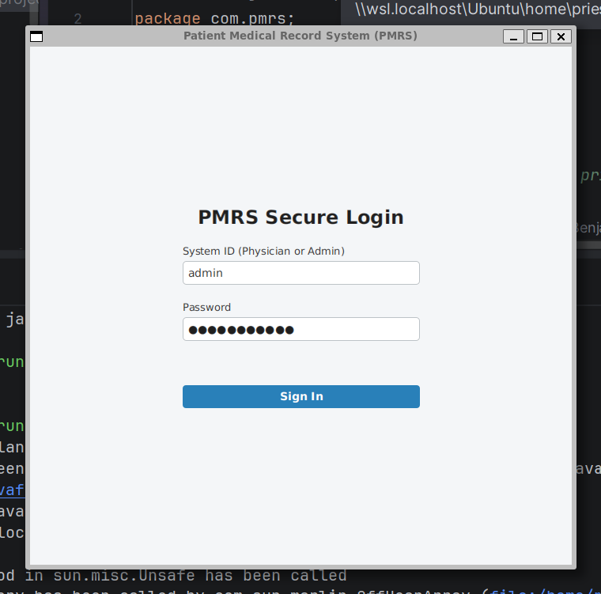
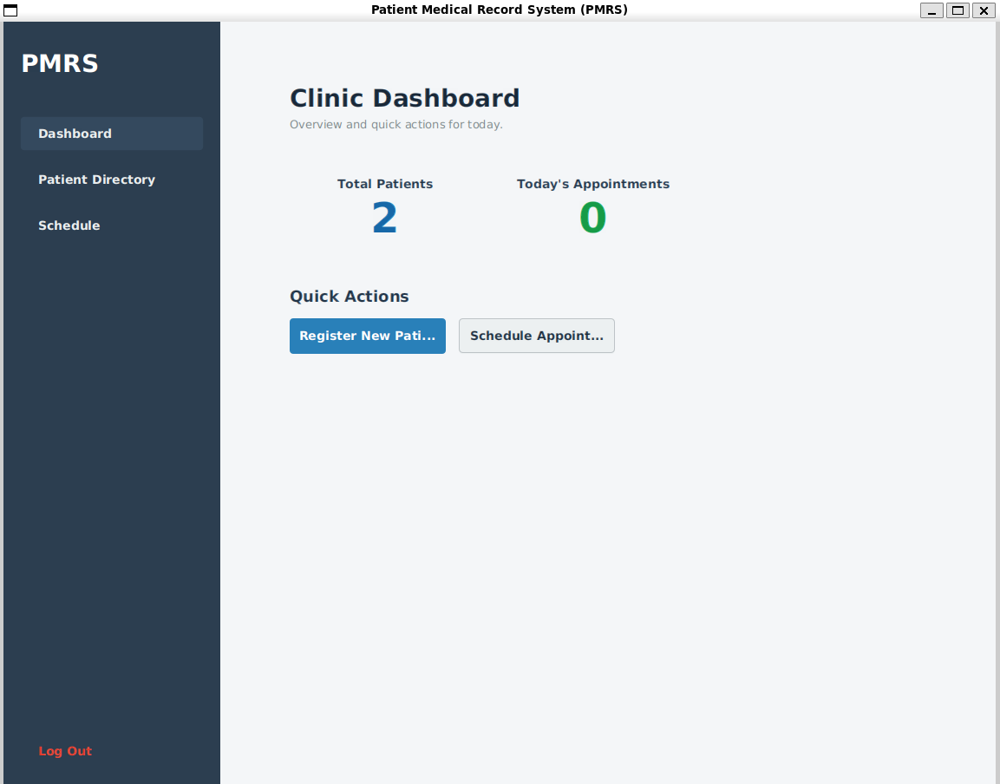
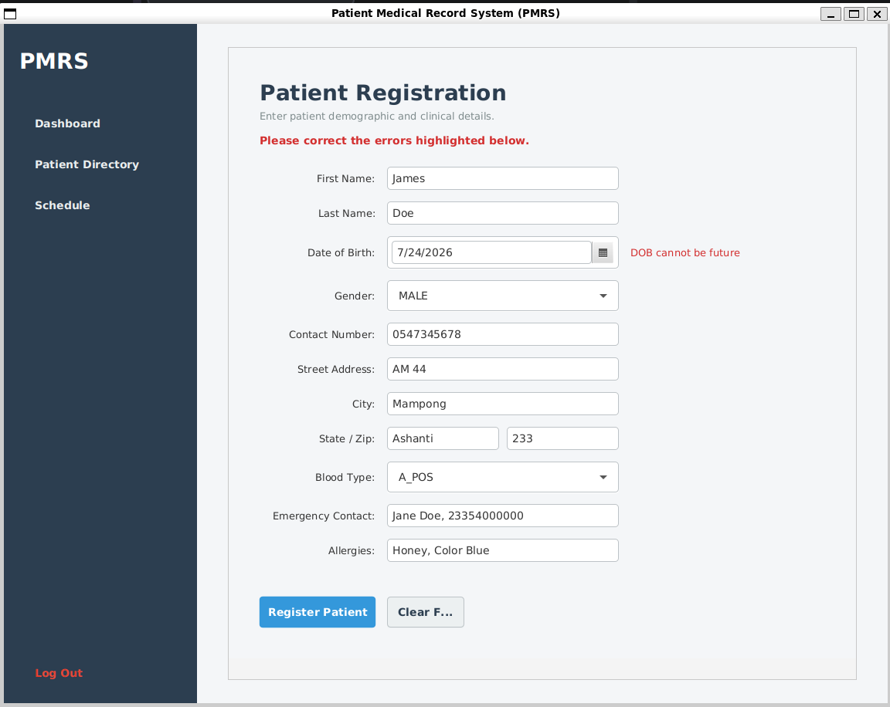
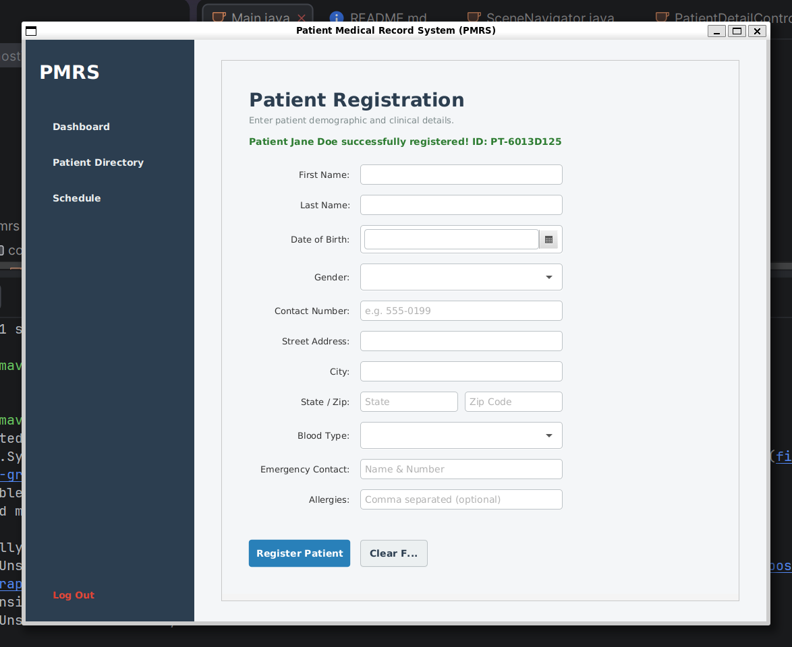
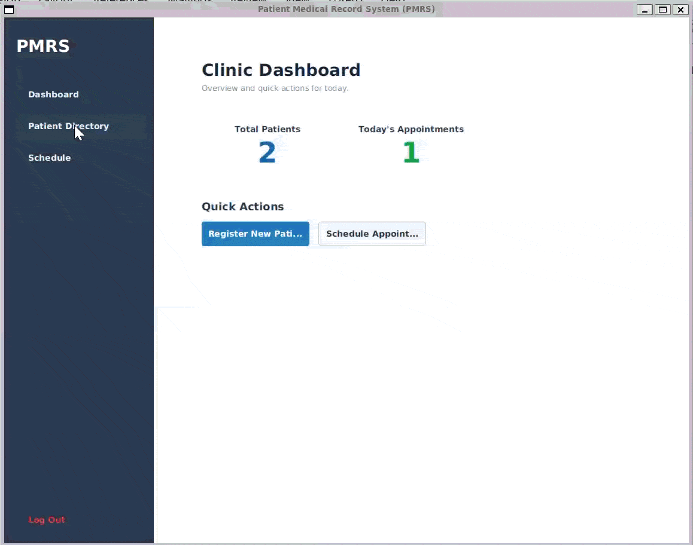
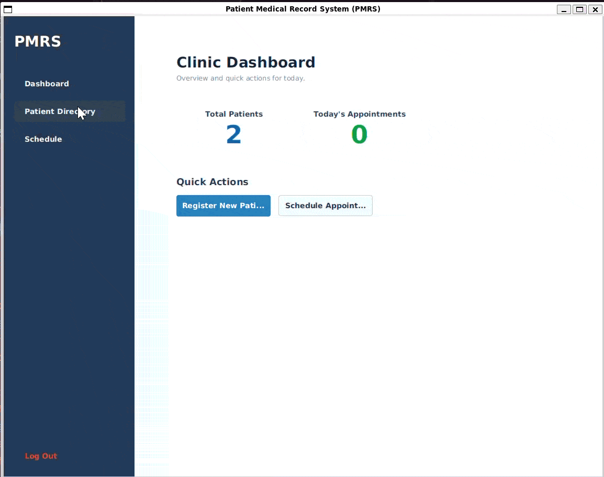

# Patient Medical Record System (PMRS)

A self-contained, desktop-based patient management system built with JavaFX. This application provides a clinical interface for registering patients, scheduling appointments, and managing medical records.

## Screenshots

![]








## Demo


<summary>Full application walkthrough </summary>




<details>
<summary>Patient registration (click to expand)</summary>


</details>

<details>
<summary>Patient directory search (click to expand)</summary>



</details>

<details>
<summary>Appointment scheduling (click to expand)</summary>


</details>

## Architecture Overview

PMRS strictly adheres to the Model-View-Controller (MVC) architectural pattern. The system is designed with a clear separation of concerns, heavily utilizing polymorphism and encapsulation.

The domain models are strictly encapsulated (using checked `ValidationException`s in setters to prevent invalid object states from ever existing in memory). The UI layer (FXML/Controllers) never interacts directly with data storage. Instead, all requests are routed through a dedicated Service layer (`PatientService`, `AppointmentService`, etc.), which handles cross-entity business logic and validation. Persistence is handled via a generic `Repository<T>` seam, currently backed by in-memory collections, allowing for a frictionless swap to a JDBC or File-backed database in future iterations without touching the UI or Service layers.

## Build and Run Instructions

This project requires **Java 17+** and **Maven** to be installed on your system.

1. Clone or extract the source directory.
2. Open a terminal in the root directory of the project (where `pom.xml` is located).
3. Compile and launch the application by running:
   ```bash
   mvn clean javafx:run
   ``` 
## Unit Test

To execute the unit tests (which verify the scheduling constraints and polymorphic search logic), run:
```aiignore
   mvn test
```

## Test Credentials
The system boots with a seeded in-memory credential store. To access the Physician dashboard, use the following login:
``` 
    System ID: admin
    Password: password123
```
